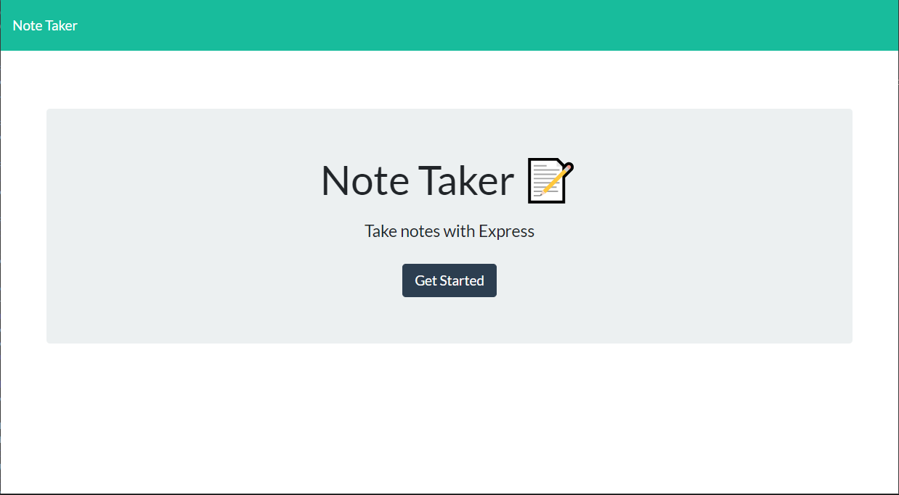
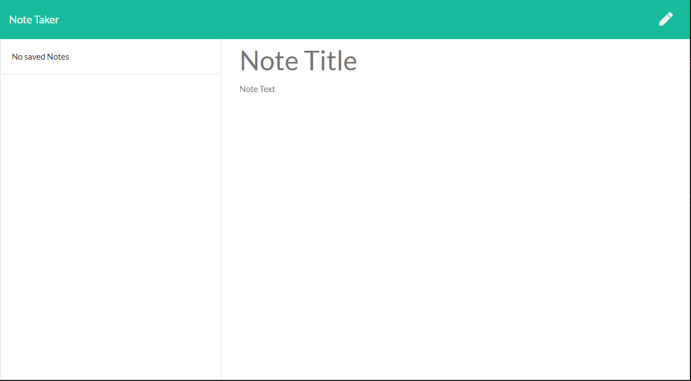
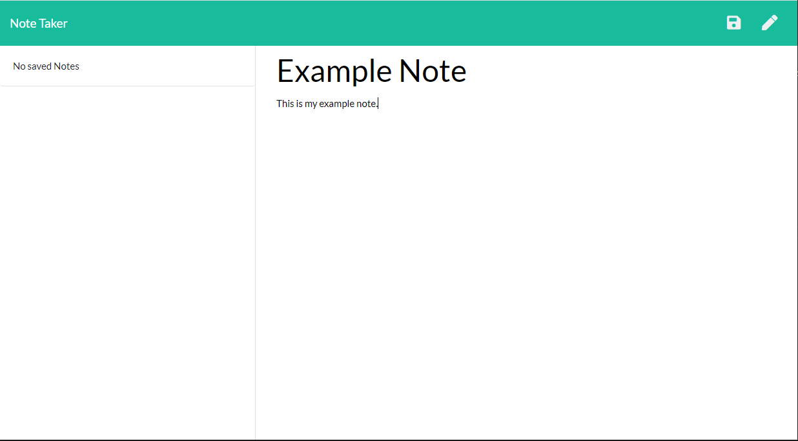
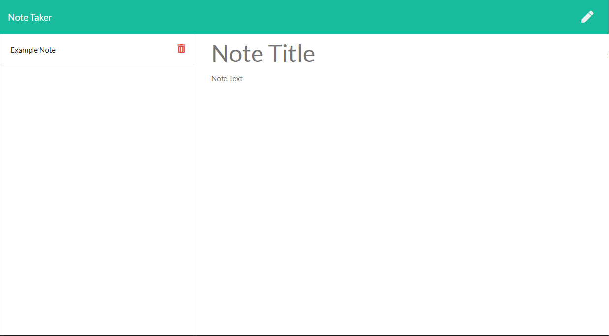

# Note Taker        

## Description  
Note Taker is a simple web application for users to create and save notes and then delete them when the user no longer needs them. It was created to help people quickly be able to create notes without having to go the traditional route with pen and paper. The app was created using Nodes.js and Inquirer.

## Table of Contents  
[Usage](#Usage)  
[Contributing](#Contributing)  
[Questions](#Questions)  
[License](#License)  

## Usage  
Go to https://mighty-earth-52877.herokuapp.com/. Click get started to go to the notes page. Type in a title and then type in your note. Click the save button in the top right hand corner to save your note. To delete a note, click on the trash can next to note title in the list of notes.

## Contributing  
To contribute to the project, fork and clone the repository to your local computer. Make changes locally and push to your main branch and submit a pull request.

## Questions 
Visit my [GitHub Profile](https://www.github.com/raiford2530)  
For additional questions, contact me by email at raiford87@gmail.com.  

## License  
MIT License

Copyright (c) 2020 Rashawn Raiford

Permission is hereby granted, free of charge, to any person obtaining a copy
of this software and associated documentation files (the "Software"), to deal
in the Software without restriction, including without limitation the rights
to use, copy, modify, merge, publish, distribute, sublicense, and/or sell
copies of the Software, and to permit persons to whom the Software is
furnished to do so, subject to the following conditions:

The above copyright notice and this permission notice shall be included in all
copies or substantial portions of the Software.

THE SOFTWARE IS PROVIDED "AS IS", WITHOUT WARRANTY OF ANY KIND, EXPRESS OR
IMPLIED, INCLUDING BUT NOT LIMITED TO THE WARRANTIES OF MERCHANTABILITY,
FITNESS FOR A PARTICULAR PURPOSE AND NONINFRINGEMENT. IN NO EVENT SHALL THE
AUTHORS OR COPYRIGHT HOLDERS BE LIABLE FOR ANY CLAIM, DAMAGES OR OTHER
LIABILITY, WHETHER IN AN ACTION OF CONTRACT, TORT OR OTHERWISE, ARISING FROM,
OUT OF OR IN CONNECTION WITH THE SOFTWARE OR THE USE OR OTHER DEALINGS IN THE
SOFTWARE.

